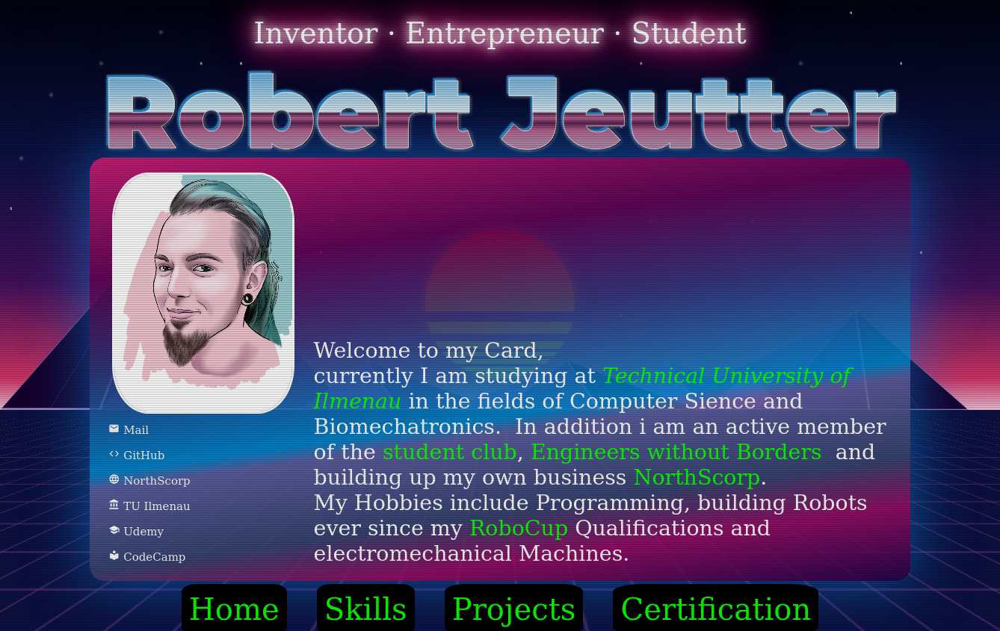
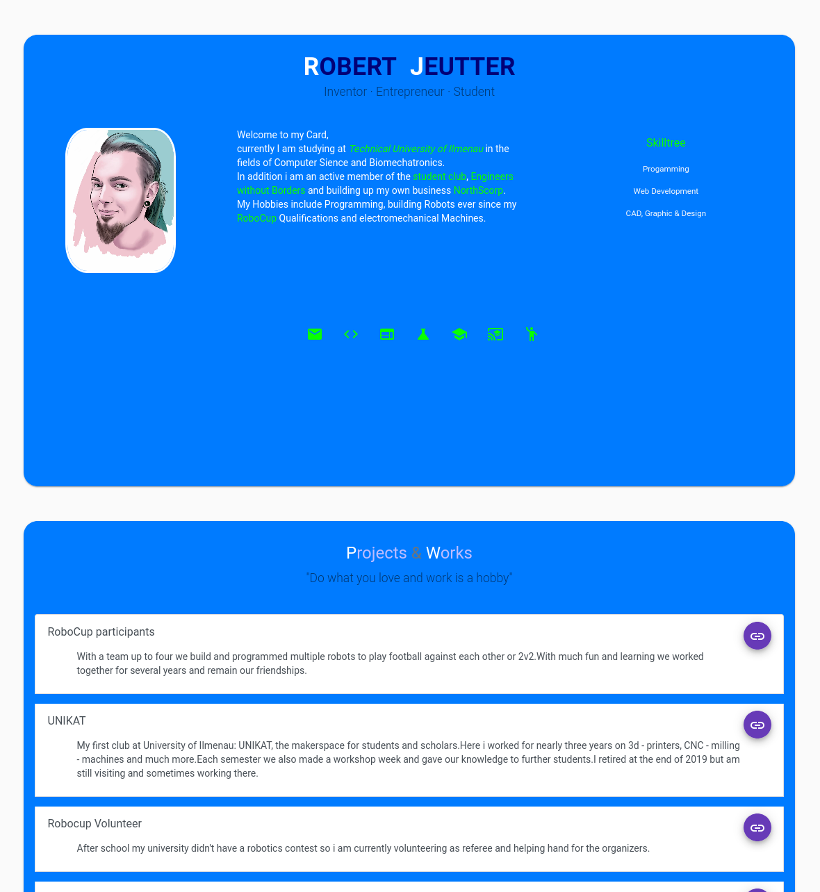

# Business Card
This is a repository with my personal angular-powered business card. Feel free to reuse this as a template for your own card but please refer back to me.
With GitHub you can Present yourself easily and without a fee, as you can setup an account and use their hosting service.

  1. SignUp/Register on GitHub to get to your profile
  2. Create a repository with the name: "YOURUSERNAME.github.io" (YOURUSERNAME is a placeholder for your own username!)
  3. Upload or create your Webfiles in the newly created repository. As GitHub only provides static content keep it simple with HTML, CSS and JS

People love it when something moves and changes it's shape, so use the power of CSS and JS to create an interactive and rememberable portfolio.


## Vue
The new Version is build with VUE. Very similar to Angular you will get easy into it.



Synthwave design based on https://codepen.io/inegoita/pen/BgdXMw?editors=1000

### Build Setup
```bash
# install dependencies
$ yarn install

# serve with hot reload at localhost:3000
$ yarn dev

# build for production and launch server
$ yarn build
$ yarn generate
$ yarn start

# generate static project
$ yarn generate
```

## Angular
This page is completely build in [Angular 9](https://angular.io). Even if you are new to programming or webdevelopment this is a realy easy start to get to simple goals really fast. All development files for this static site are in the "source" folder. Install all necassaries you need for Angular and start an command line tool to start up. Here's a list of commands:
  - `ng serve`: Starts the development server on your localhost machine. Wait for compiling and navigate to `http://localhost:4200/` on your machine. The app will automatically reload if you change any of the source files.
  - `ng build`: Compiles and builds the whole angular project. The build artifacts will be stored in the `dist/` directory (can be changed in the 'angular.json'). Use the `--prod` flag for a production build.
  - `ng generate component component-name`: run to generate a new component. You can also use `ng generate directive|pipe|service|class|guard|interface|enum|module`.
  - `ng help`: To get more help on the Angular CLI or go check out the [Angular CLI README](https://github.com/angular/angular-cli/blob/master/README.md).



### Angular Material
[Material Design](https://material.angular.io) components for Angular. Fully tested across modern browsers. Built by the Angular team to integrate seamlessly with Angular.

### Bootstrap (with jQuery)
Quickly design and customize responsive mobile-first sites with Bootstrap, the world’s most popular front-end open source toolkit, featuring Sass variables and mixins, responsive grid system, extensive prebuilt components, and powerful JavaScript plugins. [Website](https://getbootstrap.com)


Ask if you have questions and have fun!
